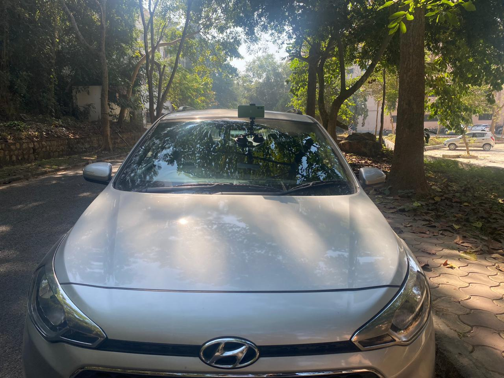
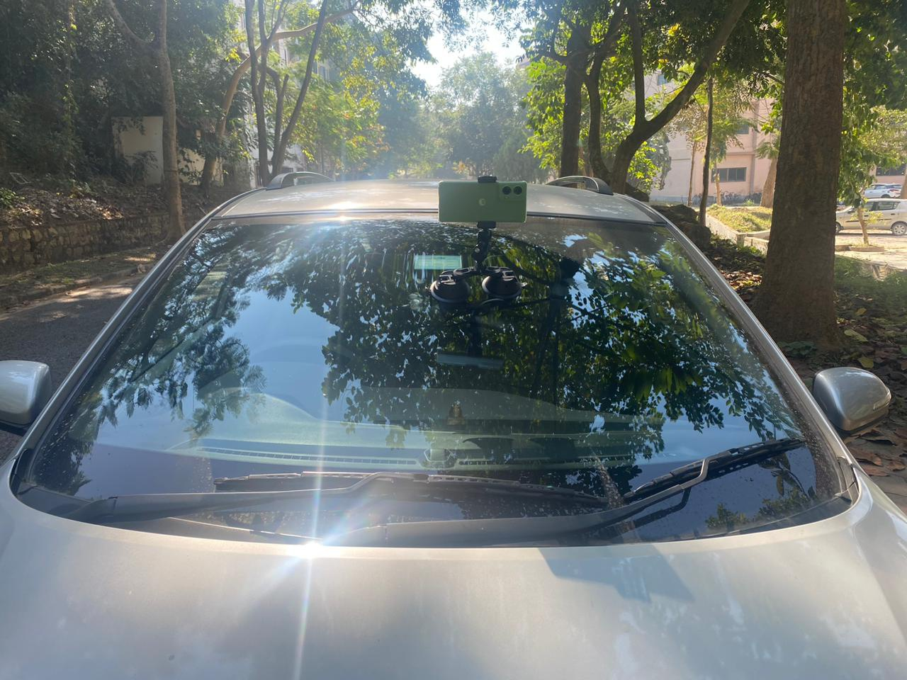

# DriveCache

This repository contains the **road scenario datasets** used for evaluating visual similarity–based caching/offloading in AV–edge settings.

---

## 📁 Road Scenarios (Folder-wise)

All **road scenarios are provided as separate folders** in this repository.

For each road scenario, we captured **multiple videos of 10–15 minutes** duration. Each scenario folder includes:
- YOLO inference outputs per frame
- Bhattacharyya similarity score plots

> ✅ **One folder = one road scenario.**

---

## 🎥 Data Collection Details

### Capture devices
- **Phone:** *Moto Edge 50 Fusion*
- Additional capture setup is shown in the images below (AV + GoPro setup)

### Video properties
- **Frame rate:** 30 FPS  
- Each video was **converted into frames**, and we ran **YOLO inference on every frame**.

---

## 🤖 YOLO Inference Outputs

For each scenario:
- Frames were extracted from the recorded videos.
- YOLO inference was executed on **each extracted frame**.
- Due to **space constraints** , we include **only a subset of frames/results** in this repository.

---

## 📊 Similarity Results (Bhattacharyya)

We also provide **Bhattacharyya similarity scores** (per frame / per scenario) used in DriveCache experiments.
These results are included for **each road scenario folder** (as CSV logs / plots, depending on the scenario).

---

## 📷 Experimental Setup Images

### AV with GoPro setup
`AV_goPro.jpeg` shows the AV with the GoPro setup.

### GoPro camera
`GoPro.jpeg` shows the GoPro camera used in the setup.

---

## ⚠️ Notes
- The complete dataset will be released after anonymity restrictions are lifted.
